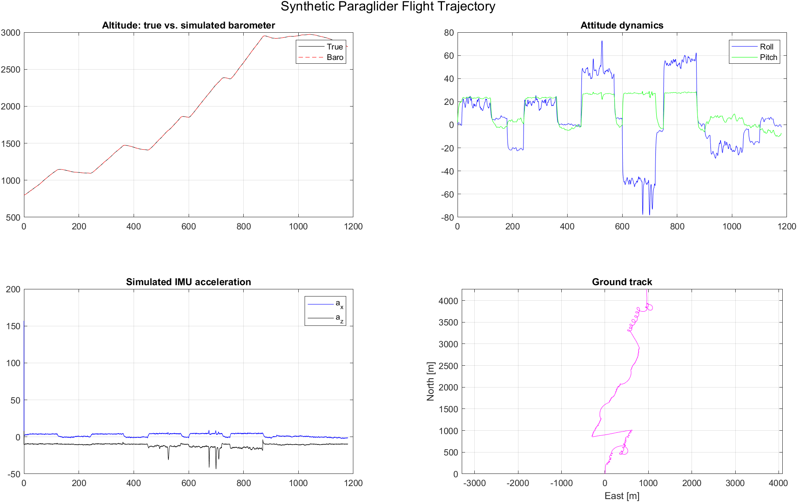

# tinyVario

**A miniature variometer built from scratch — 16 × 16 × 13 mm.**

tinyVario is a complete, from-scratch embedded firmware and electronics
project for a paragliding/hang-gliding variometer: a device that senses
and audibly reports vertical speed (lift/sink) using IMU and barometric
sensor fusion. The entire board — sensors, audio output, battery
management, and power control — fits in a volume smaller than a
fingertip.


---

## Why this project

This project set out to answer an engineering question: how small and
power-efficient can a flight-instrument-grade sensor fusion system be made
while still running reliably on a low-power 32-bit microcontroller with
8 KB of RAM? The result is a complete sensor-fusion pipeline — attitude
estimation, Kalman filtering, and audio feedback — running in real time on
a low-power Cortex-M0+ core, with a custom PCB small enough to disappear
into a harness strap.

## Key engineering highlights

- **Sensor fusion pipeline**: a Madgwick AHRS attitude filter feeds a
  dedicated Kalman filter (altitude / vertical speed / accelerometer bias)
  to turn noisy IMU and barometer readings into stable, responsive audio
  feedback on a Cortex-M0+ without an FPU or hardware division. The IMU
  update period is about 38.5 ms; measured execution time and worst-case
  deadline evidence are not yet published.
- **Offline model-based design**: the filters were first developed and
  tuned in MATLAB/Simulink against simulated flight trajectories, then
  translated to hand-optimized C for the target. The reference MATLAB
  implementations that the C code was translated from live in
  [`Core/Src/matlab_functions/`](Core/Src/matlab_functions); a
  standalone, Simulink-free validation harness that exercises them
  end-to-end is in [`matlab/`](matlab) — see
  [Simulation results](#simulation-results) below.
- **Aggressive power management**: the MCU spends almost all of its time in
  `SLEEP`/`STANDBY` mode between IMU interrupts, with full sensor
  power-down, a model-based battery state-of-charge estimate, and a
  hardware independent watchdog (IWDG) intended to reset the MCU if the
  firmware stops refreshing it; this is not a safety guarantee.
- **Robust I2C/DMA sensor pipeline**: non-blocking DMA sensor reads, a
  stall watchdog that detects and recovers a wedged I2C bus without a full
  reboot, and graceful degradation (visible error patterns on the status
  LEDs) instead of silent failure.
- **Custom hardware**: a 4-layer PCB design (schematics in
  [`ElectronicsPlan/`](ElectronicsPlan)) integrating an IMU, barometer,
  Li-Po charging/status circuitry, and a piezo buzzer driver into a
  16 × 16 × 13 mm enclosure.

## Hardware

| Component          | Part                      | Purpose                              |
|---------------------|---------------------------|---------------------------------------|
| MCU                 | STM32L031G6U6 (Cortex-M0+) | Main controller, ultra-low-power     |
| IMU                 | LSM6DS3                   | 3-axis accelerometer + gyroscope      |
| Barometer           | SPL06-001                 | Pressure/temperature → altitude       |
| Audio               | PAM8904 + piezo buzzer    | Variable-pitch lift/sink tone         |
| Battery             | Li-Po, USB charging       | Voltage/current-model estimate + charge detection |

Full schematics and the netlist are available in
[`ElectronicsPlan/`](ElectronicsPlan).

## Firmware architecture

```
Core/
├── Inc/                  Public headers for every module
├── Src/
│   ├── main.c             Power states, UI (button/LED), main loop
│   ├── vario.c             Sensor lifecycle, IMU/baro ISR glue, legacy complementary filter
│   ├── madgwick.c          Madgwick AHRS attitude filter (NED convention)
│   ├── kalman_vz.c         3-state Kalman filter: altitude, vertical speed, accel bias
│   ├── lsm6ds3.c           LSM6DS3 IMU driver (DMA + polling)
│   ├── spl06.c             SPL06 barometer driver with 64-bit fixed-point compensation
│   ├── battery.c           ADC sensing, voltage lookup + current-model SOC estimate
│   ├── buzzer.c            Audio engine: beep cadence, pitch, PAM8904 volume control
│   ├── led.c               Status LED feedback (battery level, charging, volume)
│   ├── button.c            Debounce and long-press detection
│   └── matlab_functions/  MATLAB reference implementations the C filters were translated from
└── Startup/               STM32CubeMX-generated startup assembly
```

Top-level, alongside `Core/`:

```
matlab/      Standalone MATLAB validation harness (no Simulink/Simscape required)
results/     Plots and stats generated by matlab/validate_filters.m and the Simulink model
```

The system runs a simple state machine (`STATE_OFF` / `STATE_ACTIVE` /
`STATE_CHARGING`) driven from `main.c`. In `STATE_ACTIVE`, every LSM6DS3
interrupt (~26 Hz) triggers a DMA sensor read, Madgwick attitude update,
and Kalman vertical-speed update at the configured 26 Hz IMU rate; fresh
barometer samples are consumed at about 8 Hz. The battery estimate is
updated every 2 s, and the MCU immediately returns to `SLEEP` between
events. When idle, the device autonomously powers down both sensors and
drops into `STANDBY` mode (lowest power state on the STM32L0), waking only
on a button press or USB insertion. The firmware control path uses static
storage; it does not dynamically allocate memory.

### Filter pipeline

```
LSM6DS3 (accel + gyro) ──► Madgwick AHRS ──► az_world (NED-down specific force)
                                                     │
SPL06 (pressure)        ──► altitude [m] ───────────┼──► Kalman filter ──► vertical speed ──► Buzzer
                                                     │        (h, vz, accel bias)
                                              barometer update @ ~8 Hz
```

A classic fixed-point complementary filter (the original design) is kept
available behind the `USE_MADGWICK_KALMAN` compile-time switch in
[`vario.h`](Core/Inc/vario.h) for comparison and as a low-complexity
fallback.

## Simulation results

The filter pipeline has offline reference-model results for a synthetic
~20-minute paraglider flight (thermalling, glides, wingovers) with known
ground truth, using a modeled noise profile for the LSM6DS3/SPL06-001.
These are development-model results, not measurements from hardware or a
full-trajectory run of the shipped 26 Hz firmware filter. Two reference
model runs were made:

- A full nonlinear 6-DOF Simulink/Simscape Multibody model (not published
  here — the model and its CAD assets are kept out of the repository, see
  [Reproducing the reference-model results](#reproducing-the-reference-model-results) below).
- [`matlab/validate_filters.m`](matlab/validate_filters.m): a toolbox-free
  MATLAB script anyone can run from a clone, calling the exact reference
  functions in `Core/Src/matlab_functions/` directly — no Simulink
  required.

Reported reference-model metrics:

| Signal                     | Baro-only reference KF | 3-state reference KF + Madgwick |
|----------------------------|:----------------------:|:------------------------------:|
| Altitude RMSE               | 0.21 m                 | 0.21 m                         |
| Altitude max \|error\|      | 0.50 m                 | 0.48 m                         |
| Vertical speed RMSE         | 0.11 m/s               | 0.12 m/s                       |
| Vertical speed max \|error\|| 0.72 m/s               | 0.78 m/s                       |

*(10 s warm-up excluded; values are from the 52 Hz development-tuning
Simulink run, not the 26 Hz production-tuned C estimator. The standalone
MATLAB harness also uses that 52 Hz development tuning; see its opening
comments for scope. Plots are in [`results/`](results).)*


**Honest takeaway**: for these 52 Hz reference-model results, the IMU-aided 3-state
Kalman filter is *not* meaningfully more accurate than a simple
barometer-only filter in steady-state RMSE — the barometer alone is
already a strong altitude reference. The real benefit of fusing the
Madgwick-derived vertical acceleration is latency and responsiveness
during rapid vertical speed changes (e.g. entering a thermal or a
collapse), which a static RMSE comparison over a full flight doesn't
capture well. This is reported as-is rather than cherry-picked, since an
accurate account of a design's actual tradeoffs is more useful than a
flattering but misleading one.

### Simulated flight model

Both validations fly the same synthetic ~20-minute trajectory, generated
by [`matlab/trajectory_paraglider.m`](matlab/trajectory_paraglider.m), so
the comparison above is apples-to-apples. The script builds a physically
plausible flight rather than a simple sine wave, covering:

- **19 scripted flight phases** — launch, wide thermals, glides, a
  banked turn, three "tight" high-bank thermals, a weak thermal,
  approach and a landing flare — each with its own target airspeed
  (from brake/trim/speedbar position) and stall-speed limiting in
  banked turns.
- **Wind and gusts**: an Ornstein-Uhlenbeck gust process layered on a
  mean wind field with altitude shear (power-law profile) and
  first-order lag, so the wind the glider feels responds realistically
  to altitude and gust timing rather than being constant.
- **Thermal structure**: a Gaussian radial lift profile inside each
  thermal phase, so climb rate depends on where in the turn the glider
  actually is, not just a flat per-phase constant.
- **Wing collapse events**: randomly-timed (Poisson arrival) transient
  disturbances to bank angle and sink rate during the tight-thermal
  phases, mimicking asymmetric collapses in rough air.
- **Coupled rigid-body kinematics**: coordinated-turn heading rates,
  airspeed/bank/sink-rate-coupled pitch, and a full Euler-rate →
  body-rate transform, so the simulated gyro and accelerometer outputs
  are internally consistent (cross-checked at runtime — see the
  `az_world ground truth validation error` printout, which should be
  within machine precision).
- **Sensor-realistic noise**: IMU white noise, slowly-varying bias
  instability (random walk), high-frequency vibration, low-frequency
  turbulence, and a temperature-dependent z-axis bias term; barometer
  noise is injected in the pressure domain and inverted back through
  the nonlinear pressure–altitude relationship, sampled at the real
  8 Hz baro rate with zero-order hold up to IMU rate — not simply
  added as Gaussian noise on altitude.



*(Altitude and ground track for the full flight, plus roll/pitch and raw
IMU acceleration, generated directly by `trajectory_paraglider.m`.)*

### Reproducing the reference-model results

```sh
cd matlab
matlab -batch "validate_filters"   # no toolboxes beyond base MATLAB required
```

This runs the MATLAB reference implementation at its 52 Hz development
settings; it does not execute the production-tuned C filter. It regenerates
the three `results/*_standalone.png` plots, the
trajectory overview above, and prints the RMSE/max-error table shown
earlier. The Simulink-derived plots (without the `_standalone` suffix)
come from a separate, locally-only Simscape Multibody model built around
the same `fcn_madgwick.m`/`fcn_kalman_vz.m` reference functions, kept out
of the repository because of its large third-party CAD assets; it is not
required to validate the filter math.

## Testing

The `madgwick.c` and `kalman_vz.c` pure-math modules and the settings
record logic are tested natively with GCC; no ARM toolchain or hardware is
required. The suite links the actual firmware C sources. Coverage includes
rest-state and tilted-initialization orientation checks,
a sustained-rotation normalization regression guard, Kalman convergence
and zero-velocity-update behavior, an exact-kinematics check against
closed-form integration, and fault-injection tests for both the
accelerometer and barometer outlier-rejection gates. EEPROM regressions
exercise the production settings-record code against a host flash model:
independent volume/battery persistence, reload-after-save, erased and
corrupt-record defaults, and interrupted writes.

The current C Kalman estimator uses 26 Hz constants and is characterized
by host tests; the full-trajectory RMSE table above is not evidence for
that production tuning. Matching the synthetic MATLAB sensor stream
against a host run of the production 26 Hz estimator remains future
validation work.

On a machine with `make` and a native GCC-compatible compiler installed:

```sh
make -C tests test
```

On Windows with MinGW Make:

```powershell
mingw32-make -C tests test
```

This suite also runs automatically on every push via
[GitHub Actions](.github/workflows/tests.yml). For the optional MATLAB
reference-model run, install MATLAB and run the command under
[Reproducing the reference-model results](#reproducing-the-reference-model-results).

### Persistent settings

The STM32L031 Data EEPROM region is `0x08080000–0x080803FF`. Volume and
battery estimate now occupy disjoint, versioned records within its first
nine bytes; both records use CRC-16 validation. Erased, unsupported, or
corrupt volume records default to level 3, and invalid battery records
default to zero consumed mAh. A failed Data EEPROM write increments
`dbg_eeprom_settings_write_errors` and enters the normal
`ERR_EEPROM_STORAGE` error path.

The former firmware used the same byte for both records, so the old values
cannot be migrated reliably. The first boot with this layout may therefore
restore volume to 3 and reset the stored consumed-charge estimate to zero.
Future writes are independent, and unchanged records are not reprogrammed.

The battery percentage is an estimate: voltage is mapped through a lookup
table and fused with consumed charge estimated by integrating configured
state-dependent current assumptions. There is no current-sense shunt, so
this is not a measured coulomb counter or hardware fuel gauge.

## Building

This is an STM32CubeIDE project (also buildable with plain `arm-none-eabi-gcc`
and the provided linker script, `STM32L031G6UX_FLASH.ld`).

1. Open the project in [STM32CubeIDE](https://www.st.com/en/development-tools/stm32cubeide.html).
2. Build the `Debug` or `Release` configuration.
3. Flash via ST-Link/SWD (`tinyVario Debug.launch` is provided for
   debugging directly from CubeIDE).

The `.ioc` file (`tinyVario.ioc`) can be reopened in STM32CubeMX to
regenerate peripheral initialization code; all application logic lives
outside the generated `USER CODE` boundaries and is untouched by
regeneration.

## Author

Designed, built, and written by **Luca Obwegs**.

## License

Released under the [GNU General Public License v3.0](LICENSE).
