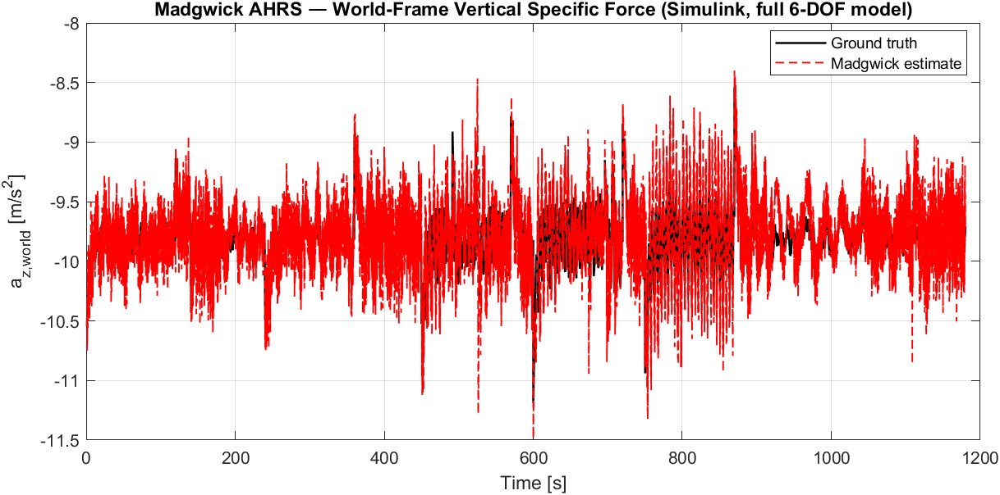
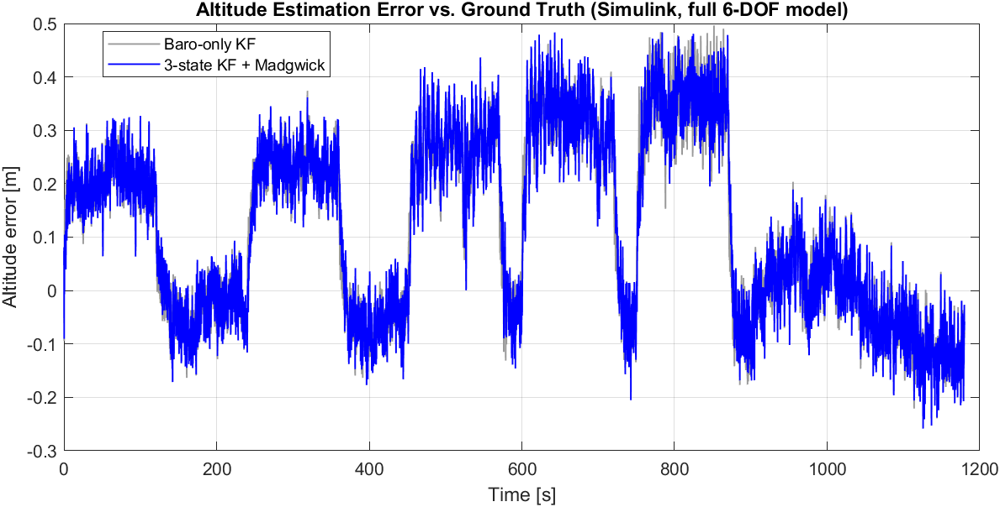
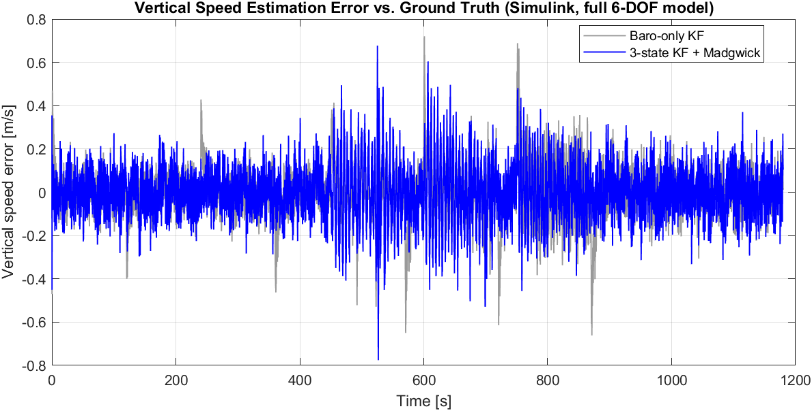

# tinyVario (LiftSense Mini)

**The smallest variometer ever built — 16 × 16 × 13 mm.**

tinyVario is a complete, from-scratch embedded firmware and electronics
project for a paragliding/hang-gliding variometer: a device that senses
and audibly reports vertical speed (lift/sink) using IMU and barometric
sensor fusion. The entire board — sensors, audio output, battery
management, and power control — fits in a volume smaller than a
fingertip.


---

## Why this project

Commercial variometers are bulky, expensive, and power-hungry. This project
set out to answer a narrower engineering question: how small and
power-efficient can a flight-instrument-grade sensor fusion system be made
while still running reliably on a cheap 8-bit-class microcontroller with
8 KB of RAM? The result is a complete sensor-fusion pipeline — attitude
estimation, Kalman filtering, and audio feedback — running in real time on
a low-power Cortex-M0+ core, with a custom PCB small enough to disappear
into a harness strap.

## Key engineering highlights

- **Sensor fusion pipeline**: a Madgwick AHRS attitude filter feeds a
  dedicated Kalman filter (altitude / vertical speed / accelerometer bias)
  to turn noisy IMU and barometer readings into stable, responsive audio
  feedback — all in fixed real-time budget on a Cortex-M0+ with no FPU
  hardware division.
- **Offline model-based design**: the filters were first developed and
  tuned in MATLAB/Simulink against simulated flight trajectories, then
  translated to hand-optimized C for the target. The reference MATLAB
  implementations that the C code was translated from live in
  [`Core/Src/matlab_functions/`](Core/Src/matlab_functions); a
  standalone, Simulink-free validation harness that exercises them
  end-to-end is in [`matlab/`](matlab) — see
  [Simulation results](#simulation-results) below.
- **Aggressive power management**: the MCU spends almost all of its time in
  `SLEEP`/`STANDBY` mode between IMU interrupts, with full sensor
  power-down, coulomb-counted battery fuel gauge, and a hardware
  independent watchdog (IWDG) that guarantees recovery from any firmware
  fault.
- **Robust I2C/DMA sensor pipeline**: non-blocking DMA sensor reads, a
  stall watchdog that detects and recovers a wedged I2C bus without a full
  reboot, and graceful degradation (visible error patterns on the status
  LEDs) instead of silent failure.
- **Custom hardware**: a 4-layer PCB design (schematics in
  [`ElectronicsPlan/`](ElectronicsPlan)) integrating an IMU, barometer,
  Li-Po charge/fuel-gauge circuitry, and a piezo buzzer driver into a
  16 × 16 × 13 mm enclosure.

## Hardware

| Component          | Part                      | Purpose                              |
|---------------------|---------------------------|---------------------------------------|
| MCU                 | STM32L031G6U6 (Cortex-M0+) | Main controller, ultra-low-power     |
| IMU                 | LSM6DS3                   | 3-axis accelerometer + gyroscope      |
| Barometer           | SPL06-001                 | Pressure/temperature → altitude       |
| Audio               | PAM8904 + piezo buzzer    | Variable-pitch lift/sink tone         |
| Battery             | Li-Po, USB charging       | Onboard fuel gauge + charge detection |

Full schematics and the netlist are available in
[`ElectronicsPlan/`](ElectronicsPlan).

## Firmware architecture

```
Core/
├── Inc/                  Public headers for every module
├── Src/
│   ├── main.c             Power states, UI (button/LED), main loop
│   ├── vario.c             Sensor lifecycle, IMU/baro ISR glue, legacy complementary filter
│   ├── madgwick.c          Madgwick AHRS attitude filter (NED convention)
│   ├── kalman_vz.c         3-state Kalman filter: altitude, vertical speed, accel bias
│   ├── lsm6ds3.c           LSM6DS3 IMU driver (DMA + polling)
│   ├── spl06.c             SPL06 barometer driver with 64-bit fixed-point compensation
│   ├── battery.c           ADC battery sensing, SOC estimation, coulomb counting
│   ├── buzzer.c            Audio engine: beep cadence, pitch, PAM8904 volume control
│   ├── led.c               Status LED feedback (battery level, charging, volume)
│   ├── button.c            Debounce and long-press detection
│   └── matlab_functions/  MATLAB reference implementations the C filters were translated from
└── Startup/               STM32CubeMX-generated startup assembly
```

Top-level, alongside `Core/`:

```
matlab/      Standalone MATLAB validation harness (no Simulink/Simscape required)
results/     Plots and stats generated by matlab/validate_filters.m and the Simulink model
```

The system runs a simple state machine (`STATE_OFF` / `STATE_ACTIVE` /
`STATE_CHARGING`) driven from `main.c`. In `STATE_ACTIVE`, every LSM6DS3
interrupt (~26 Hz) triggers a DMA sensor read, Madgwick attitude update,
and Kalman vertical-speed update, after which the MCU immediately returns
to `SLEEP` to conserve power. When idle, the device autonomously powers
down both sensors and drops into `STANDBY` mode (lowest power state on the
STM32L0), waking only on a button press or USB insertion.

### Filter pipeline

```
LSM6DS3 (accel + gyro) ──► Madgwick AHRS ──► az_world (NED-down specific force)
                                                     │
SPL06 (pressure)        ──► altitude [m] ───────────┼──► Kalman filter ──► vertical speed ──► Buzzer
                                                     │        (h, vz, accel bias)
                                              barometer update @ ~8 Hz
```

A classic fixed-point complementary filter (the original design) is kept
available behind the `USE_MADGWICK_KALMAN` compile-time switch in
[`vario.h`](Core/Inc/vario.h) for comparison and as a low-complexity
fallback.

## Simulation results

The filter pipeline was validated offline against a synthetic ~20-minute
paraglider flight (thermalling, glides, wingovers) with known ground
truth, using the same noise model as the real LSM6DS3/SPL06-001 hardware.
Two complementary validations were run:

- A full nonlinear 6-DOF Simulink/Simscape Multibody model (not published
  here — the model and its CAD assets are kept out of the repository, see
  [Reproducing these results](#reproducing-these-results) below).
- [`matlab/validate_filters.m`](matlab/validate_filters.m): a toolbox-free
  MATLAB script anyone can run from a clone, calling the exact reference
  functions in `Core/Src/matlab_functions/` directly — no Simulink
  required.

Both agree closely on the headline numbers:

| Signal                     | Baro-only KF | 3-state KF + Madgwick |
|----------------------------|:------------:|:---------------------:|
| Altitude RMSE               | 0.21 m       | 0.21 m                |
| Altitude max \|error\|      | 0.50 m       | 0.48 m                |
| Vertical speed RMSE         | 0.11 m/s     | 0.12 m/s              |
| Vertical speed max \|error\|| 0.72 m/s     | 0.78 m/s              |

*(10 s warm-up excluded; numbers from the Simulink run — see
[`results/`](results) for plots from both validations.)*





**Honest takeaway**: on this synthetic trajectory, the IMU-aided 3-state
Kalman filter is *not* meaningfully more accurate than a simple
barometer-only filter in steady-state RMSE — the barometer alone is
already a strong altitude reference. The real benefit of fusing the
Madgwick-derived vertical acceleration is latency and responsiveness
during rapid vertical speed changes (e.g. entering a thermal or a
collapse), which a static RMSE comparison over a full flight doesn't
capture well. This is reported as-is rather than cherry-picked, since an
accurate account of a design's actual tradeoffs is more useful than a
flattering but misleading one.

### Reproducing these results

```sh
cd matlab
matlab -batch "validate_filters"   # no toolboxes beyond base MATLAB required
```

This regenerates the three `results/*_standalone.png` plots and prints
the RMSE/max-error table above. The Simulink-derived plots (without the
`_standalone` suffix) come from a separate, locally-only Simscape
Multibody model built around the same `fcn_madgwick.m`/`fcn_kalman_vz.m`
reference functions, kept out of the repository because of its large
third-party CAD assets; it is not required to validate the filter math.

## Testing

The two pure-math modules — `madgwick.c` (attitude estimation) and
`kalman_vz.c` (vertical-speed Kalman filter) — have zero HAL/MCU
dependencies, so they're covered by a native unit test suite that builds
and runs on the host with plain `gcc` (no ARM toolchain or hardware
required). The tests link the real firmware source directly; there are no
mocks of the filter logic.

```sh
make -C tests test
```

Coverage includes rest-state and tilted-initialization orientation checks,
a sustained-rotation normalization regression guard, Kalman convergence
and zero-velocity-update behavior, an exact-kinematics check against
closed-form integration, and fault-injection tests for both the
accelerometer and barometer outlier-rejection gates. This suite runs
automatically on every push via [GitHub Actions](.github/workflows/tests.yml).

## Building

This is an STM32CubeIDE project (also buildable with plain `arm-none-eabi-gcc`
and the provided linker script, `STM32L031G6UX_FLASH.ld`).

1. Open the project in [STM32CubeIDE](https://www.st.com/en/development-tools/stm32cubeide.html).
2. Build the `Debug` or `Release` configuration.
3. Flash via ST-Link/SWD (`LiftSenseMiniV3 Debug.launch` is provided for
   debugging directly from CubeIDE).

The `.ioc` file (`LiftSenseMiniV3.ioc`) can be reopened in STM32CubeMX to
regenerate peripheral initialization code; all application logic lives
outside the generated `USER CODE` boundaries and is untouched by
regeneration.

## Author

Designed, built, and written by **Luca Obwegs**.

## License

Released under the [GNU General Public License v3.0](LICENSE).
